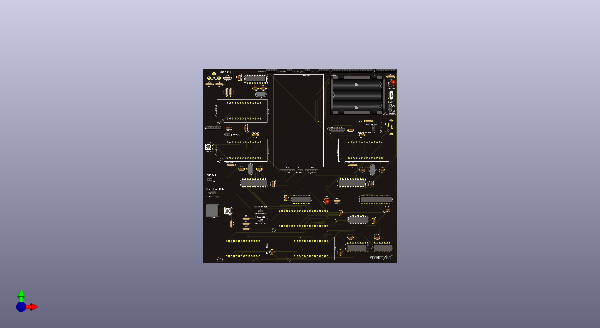

# SmartyKit One, Apple-1 compatible computer's Single-board PCB gerbers

SmartyKit One (http://www.smartykit.io/), Apple-1 compatible computer's PCB production files:
* Gerbers with SMD (LED) pick&place files
* Schematics
* Assembly Drawing
* 3D Preview

These particular files were successfully used with JLCPCB.

This board is quite popular having almost 1 million views on TikTok: https://vt.tiktok.com/ZSN6fEfT1/

Short demo on how it works: https://youtube.com/shorts/yasQL7dERKI?si=belrGXeBrC0KbUY7

Then you can decorate your office or WFH study in a geeky way: https://www.instagram.com/p/CnwZLHJIJ2m/?igshid=MzRlODBiNWFlZA==

SmartyKit Discord community could be helpful during the build. 

## Video instruction on ordering from JLCPCB

## LED part number

For Power-On LED in 0603 package used – Everlight Elec, Part# 19-217/GHC-YR1S2/3T.

[JLCPCB Part# C72043](https://jlcpcb.com/partdetail/EverlightElec-19_217_GHC_YR1S23T/C72043)

## Questions?

You could contact Sergey (sergey@smartykit.io) or reach us on X (Twitter) ([@SmartyKitE](https://www.twitter.com/SmartyKitE)).

